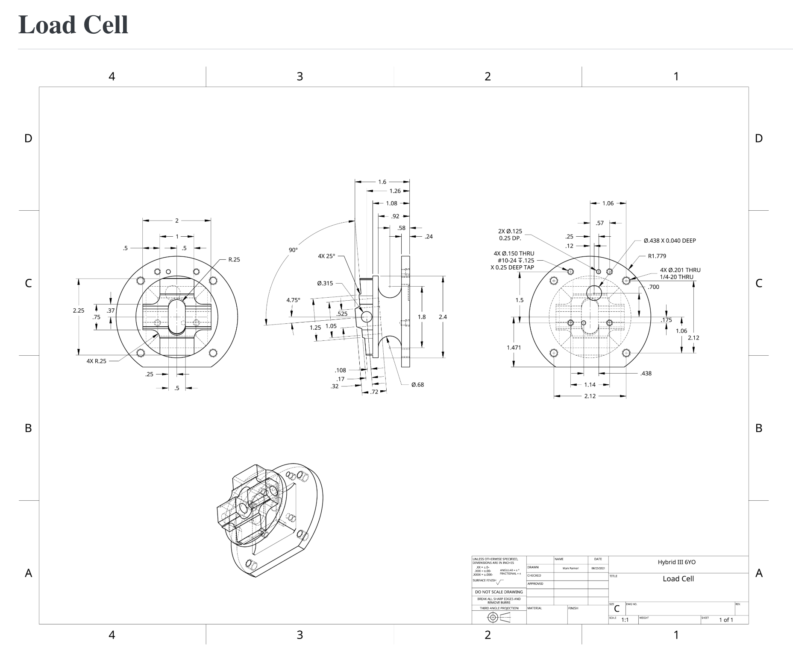
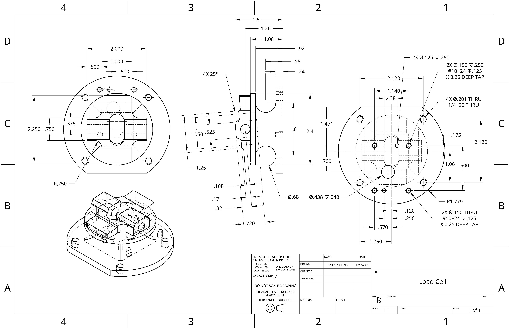

## 2D Blueprint to 3D CAD Reconfiguration (6Yr Old)

  
  

    
    
2D CAD Drawing Provided to us as a guide.

  

  
  

    
    
2D Drawing of my replica of the Load Cell.

  

The objective was to take a complex, multi-view 2D engineering drawings and accurately replicate them as 3D models. The challenge lay in correctly interpreting intricate geometric tolerances, hidden views, and maintaining design intent so that any future dimensional changes would update seamlessly across the model.

  <a href="https://cad.onshape.com/documents/eb6e289ed05d07266b6ba426/w/ca134d3ec821955ecd2be735/e/05d6ec63819e9a8e71cf58d3" 
     target="_blank"
     style="background-color: #159957; color: white; padding: 10px 20px; border-radius: 6px; text-decoration: none; font-weight: bold; text-align: center;">
    📐 View OnShape Model
  </a>
  <a href="https://github.com/carlotagillard/carlotagillard.github.io/tree/main/Hybrid%20III%206%20y_o%20Lab%20%E2%80%93%20MedTech%20Prototyping%20Skills.pdf"
     target="_blank"
     style="background-color: #159957; color: white; padding: 10px 20px; border-radius: 6px; text-decoration: none; font-weight: bold; text-align: center;">
    📜 View Assignment PDF
  </a>

## Acrylic Phone Stand and Cardboard Box Laser-Cut

Used Adobe Illustrator to create and design both a phone stand out of acrylic and a cardboard box, wich were then cut out and engraved using a lazer cutter. An acryic bender was also used on the phone stand.

🔗 [Adobe Illustrator Files](https://github.com/carlotagillard/images/laser)

## Key Chains
More detail here than on the homepage — what was your role, what problems did you solve, what did you learn?

---

[← Back to Home](../index.md)
