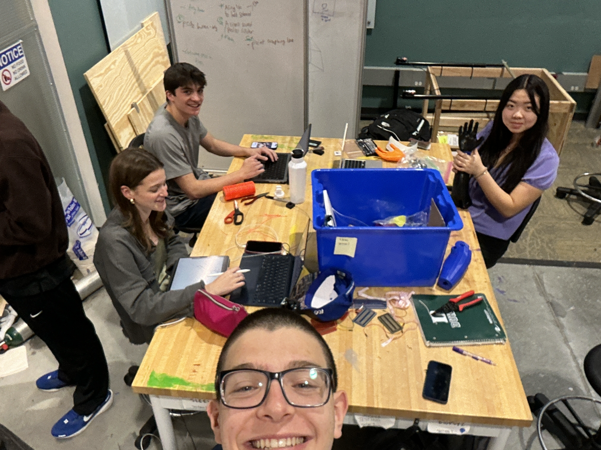
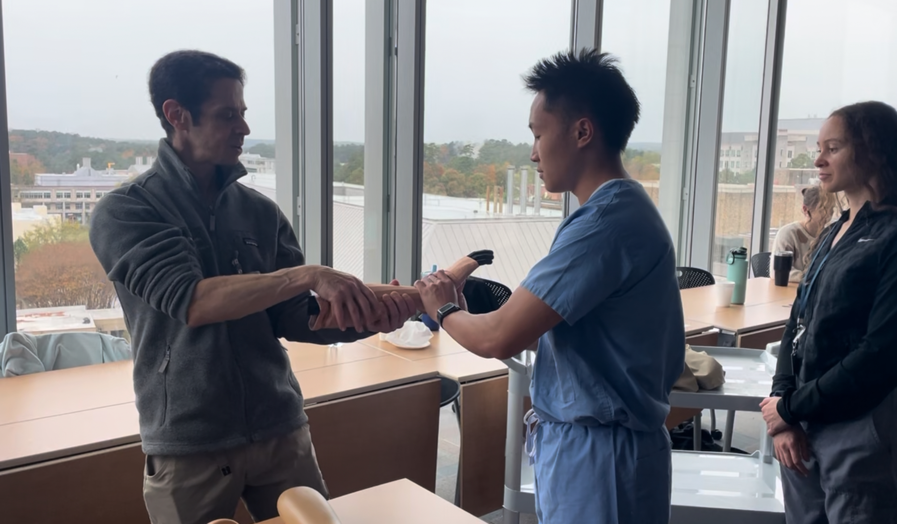

  

## Overview
- Existing orthopedic training models are often fragile, expensive, and lack the anatomical realism necessary for effective surgical residency training.
- We were tasked by Dr. Josh Border (Orthopedic Surgeon) and David Mercer (Product Engineer) to advance an early-stage prototype into a functional, anatomically accurate, and cost-effective training device for the Duke University Hospital.

## The Tech

- Utilized a rigorous design thinking process to iterate through multiple versions in Onshape, evolving the device from a simple one-step mechanism into a complex "guided maze" that mimics the resistance of a real reduction.
- Conducted comparative testing on various 3D-printing materials to achieve a balance between the durability required for repeated clinical use and the low production costs necessary for hospital scalability.

## The Work & Results

  

    
    
  

  <ul>
    <li>Managed the end-to-end design cycle within a four-person engineering team from September to December 2024.</li>
    <li>Acted as the lead designer to translate surgical requirements from Dr. Border into a functional training device for residents.</li>
  </ul>

## Results & Testing

- Conducted a series of tests both at the Duke Hopsital with Emergency Doctors, Dr. Broder himself, and his residents, as well as our own peers. In doing so, the were abel to confirm accuracy, and durability.
- Overall, we successfully transformed a prototype that offered little guidance into an anatomically accurate model that adequately guides a resident through the force and trajectory required for a successful fracture reduction.

  

    
    
Image of ER doctors trying to reduce the Model.

  

  

    
    
Image of Dr. Josh Broder with one of his Orthopedic Residents utilizing the model arm.

  

## Resources

  <a href="https://cad.onshape.com/documents/eb6e289ed05d07266b6ba426/w/ca134d3ec821955ecd2be735/e/05d6ec63819e9a8e71cf58d3" 
     target="_blank"
     style="background-color: #159957; color: white; padding: 10px 20px; border-radius: 6px; text-decoration: none; font-weight: bold;">
    📐 View OnShape Model
  </a>
  <a href="https://youtu.be/4MaEyghUxlk" 
     target="_blank"
     style="background-color: #159957; color: white; padding: 10px 20px; border-radius: 6px; text-decoration: none; font-weight: bold;">
    ▶️ Watch Prototype Video
  </a>
  <a href="https://github.com/carlotagillard/carlotagillard.github.io/tree/main/images/distal" 
   target="_blank"
   style="background-color: #159957; color: white; padding: 10px 20px; border-radius: 6px; text-decoration: none; font-weight: bold;">
  📁 View All Photos
  </a>

---

[← Back to Home](../index.md)
